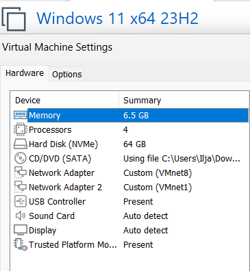
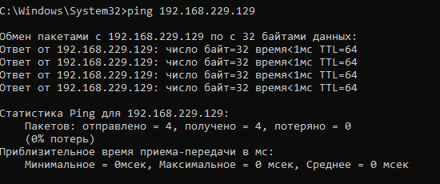
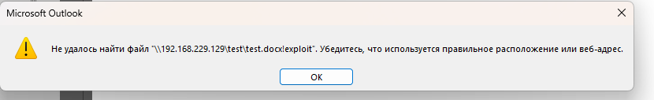
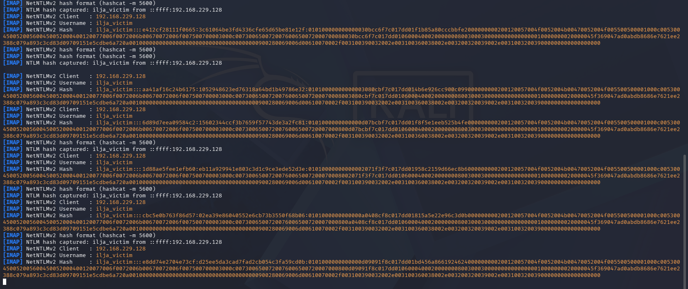
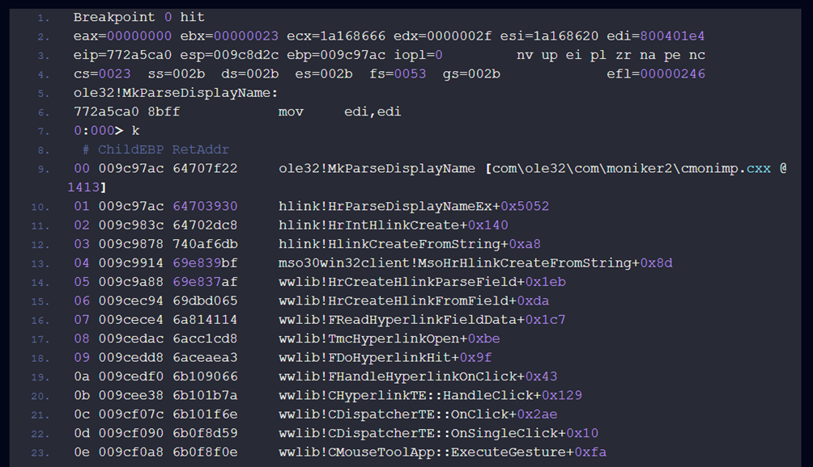

## Microsoft Outlook CVE-2024-21413
CVE-2024-21413 Moniker Links — это критическая уязвимость (с оценкой 9.8 по шкале CVSS) кражи учетных данных, обнаруженная в почтовом клиенте Microsoft Outlook. Паспорт уязвимости: [CVE-2024-21413 (Moniker Link)](https://www.cve.org/CVERecord?id=CVE-2024-21413)

## Отчеты, по которому проводилось исследование уязвимости: 
1. [Check Point research](https://research.checkpoint.com/2024/the-risks-of-the-monikerlink-bug-in-microsoft-outlook-and-the-big-picture/), собственно те, кто нашел уязвимость
2. [Отчет](https://medium.com/@sithuminzin969/understanding-the-microsoft-outlook-vulnerability-cve-2024-21413-moniker-link-53885e5f77bf), основной отчет, из которого взята теория и порядок эксплуатации
3. [CMNatic repository](https://github.com/CMNatic/CVE-2024-21413), репозиторий, из которого удобно взять exploit скрипт

## Суть проблемы и причины реализации уязвимости
Check Point в своем отчете объясняют, что уязвимость, которую они назвали "Moniker Link", позволяет обойти встроенные средства защиты Outlook от вредоносных ссылок в электронных письмах. Для этого используется протокол `file://` и специальный символ `!` в ссылке для доступа к удаленному SMB-ресурсу злоумышленников. Ошибка логики Outlook заключалась в том, что после проверки URL протокола file:// Outlook запускал системные функции Windows ради обеспечения обратной совместимости (Backward Compatibility). Таким образом, ссылка попадала в MkParseDisplayName, которая в свою очередь видела в ссылке составной Moniker и воспроизводила его. В итоге Outlook видел, что передает обычную строку, а COM-обработчик видел команду создания Moniker. Поскольку управление перехватывал системный механизм Moniker, стандартная песочница Office (Protected View) просто не активировалась. 

В результате происходит передача NTLM-хеша учетной записи пользователя на сервер злоумышленника без каких-либо предупреждений. Полученные учетные данные могут быть использованы для дальнейших атак, например для аутентификации в сети или подбора пароля. Для успешной эксплуатации достаточно, чтобы пользователь открыл письмо в уязвимой версии Outlook.

## Архитектура VMware
1. **Windows 11 (version 23H2)** (Виртуальная машина с уязвимой версией операционной системы Windows и установленным Microsoft Outlook 2019)
2. **Kali linux (version 2026.2)** (виртуальная машина, выполняющая роль удаленного SMB-сервера, необходимого для моделирования сетевого взаимодействия при обработке Moniker-ссылок)
3. **Microsoft office 2019 (Outlook version: 2002 build 12527.22253)**

  


Настройки и конфигурация лаборатории. 

## Демонстрация эксплуатации
В первую очередь поднимем SMB-сервер на Kali. Это можно сделать при помощи Responder или встроенной команды "Impacket-smbserver". Используем Responder, так как основная цель - продемонстрировать утечку NTLM хэша, Responder специально создан для перехвата именно SMB аутентификации. Команда ```sudo responder -I eth0``` откроет Responder на Kali Linux. 


После включения Responder убеждаемся, что в нашей лаборатории Windows может достичь поднятого SMB сервера(одно из условий выполнения уязвимости).




Запустим SMTP сервер на Kali (Postfix + Dovecot). Чтобы доставить письмо в Outlook в «первозданном» виде (если отправить обычным письмом, наверняка Outlook или другой почтовый сервис заблокирует письмо с потенциально опасным типом file://, решено полностью отказаться от интернета и поднять легитимную почту прямо на Kali Linux:
```
sudo apt update && sudo apt install -y postfix dovecot-imapd python3-aiosmtpd python3-dnspython
```
Далее создадим почтовый ящик: 
```
sudo adduser ilja_victim
```
Далее настройки Postfix и Dovecot: 
```
# Указали домены, для которых почта считается локальной
sudo postconf -e "mydestination = kali.local, localhost.localdomain, localhost"

# Включили SASL-аутентификацию и связали её с Dovecot
sudo postconf -e "smtpd_sasl_auth_enable = yes"
sudo postconf -e "smtpd_sasl_type = dovecot"
sudo postconf -e "smtpd_sasl_path = private/auth"
sudo postconf -e "smtpd_sasl_security_options = noanonymous"
sudo postconf -e "broken_sasl_auth_clients = yes"

# Настроили правила доверия для локальной сети стенда
sudo postconf -e "smtpd_recipient_restrictions = permit_mynetworks, permit_sasl_authenticated, reject_unauth_destination"

```
Для удобства был создан скрипт **setup_lab.sh**, чтобы запустить используем: 
```
chmod +x /home/kali/setup_lab.sh
sudo /home/kali/setup_lab.sh

```
Для запуска локальной почты, используем: 
```
sudo systemctl start postfix dovecot
```
Используя python-скрипт **CVE_exploit.py** отправим письмо, используя команды: 
```
python3 /home/kali/CVE_exploit.py   # Отправка сформированного HTML-письма
```


В итоге жертва получает следующее письмо: 


При нажатии на письмо происходит следующее: 




NTLM хэш успешно был получен злоумышленником. С помощью этого хэша можно подобрать пароль (например брутфорсом). Также можно переслать его на соседний сервер сети.
В машине Windows, для нахождения Moniker, вызывается функция MkParseDisplayName. Убедились в этом при помощи Windbg программы. После перехода по ссылке выполнение программы было остановлено в момент вызова данной функции.




## Меры по устранению
1. Использование инструмента Wireshark для анализа сетевого трафика может помочь выявить кражу NTLM хэша. Аналитикам следует обращать внимание на необычные запросы типа SMB, а также на поврежденные значения хэшей типа NetNTLMv2. Эти признаки могут указывать на попытки злоумышленников воспользоваться уязвимостью.
2. Программа Microsoft Outlook должна быть обновлена до последних версий с учетом всех вышедших от Microsoft патчей по безопасности.
3. Управление трафиком по протоколу SMB с помощью правил брандмауэра, а также отслеживайте различные сегменты сети для предотвращения распространения вредоносных программ.
4. В современных версиях Windows можно на системном уровне запретить операционной системе автоматически отдавать хэш пароля сторонним серверам (через реестр или GPO). 
5. Пароли пользователей должны быть длинными (от 12–14 символов) и не должны состоять из словарных слов. Это делает атаку перебора экономически невыгодной и долгой.
Также можно рассмотреть работу синей команды, например Флориан Рот создал инструмент (скрипт), который отслеживает такие эксплойт письма, оно проверяет письмо на протокол file://, а также проверяет, есть ли в письме ссылка на файл с таким расширением, после которого идет символ "!". 
```yara
rule EXPL_CVE_2024_21413_Microsoft_Outlook_RCE_Feb24 {  
  
meta:  
  
description = "Detects emails that contain signs of a method to exploit CVE-2024-21413 in Microsoft Outlook"  
  
author = "X__Junior, Florian Roth"  
  
reference = "https://github.com/xaitax/CVE-2024-21413-Microsoft-Outlook-Remote-Code-Execution-Vulnerability/"  
  
date = "2024-02-17"  
  
modified = "2024-02-19"  
  
score = 75  
  
strings:  
  
$a1 = "Subject: "  
  
$a2 = "Received: "  
  
  
  
$xr1 = /file:\/\/\/\\\\[^"']{6,600}\.(docx|txt|pdf|xlsx|pptx|odt|etc|jpg|png|gif|bmp|tiff|svg|mp4|avi|mov|wmv|flv|mkv|mp3|wav|aac|flac|ogg|wma|exe|msi|bat|cmd|ps1|zip|rar|7z|targz|iso|dll|sys|ini|cfg|reg|html|css|java|py|c|cpp|db|sql|mdb|accdb|sqlite|eml|pst|ost|mbox|htm|php|asp|jsp|xml|ttf|otf|woff|woff2|rtf|chm|hta|js|lnk|vbe|vbs|wsf|xls|xlsm|xltm|xlt|doc|docm|dot|dotm)!/  
  
condition:  
  
filesize < 1000KB  
  
and all of ($a*)  
  
and 1 of ($xr*)  
  
}
```

## Вывод
В ходе исследования была успешно воспроизведена эксплуатация CVE-2024-21413 в изолированной лабораторной среде. Подтвержден факт передачи NetNTLMv2-хэша на SMB-сервер злоумышленника при обработке Moniker-ссылки в уязвимой версии Microsoft Outlook. Дополнительно с использованием WinDbg подтвержден вызов функции MkParseDisplayName, что соответствует механизму эксплуатации, описанному исследователями Check Point.
